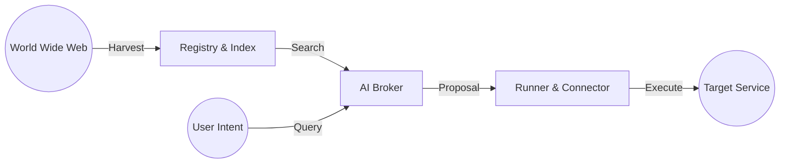

# IntentLink System Architecture
> "A holistic view of the IntentLink ecosystem components and data flow."

## 🏗️ System Overview

IntentLink operates as a continuous pipeline that transforms the chaotic web into a structured, executable network.



## 🧩 Core Components

### 1. Discovery Layer (Input)
- **Harvester (`registry/awesome-harvester.js`):** Crawls web sources (Awesome Lists) to find service candidates.
- **Extractor Skill (`skills/link-extractor`):** An AI agent skill that reads raw documentation and generates structured `link.json` manifests.
- **Validator (`validator/link-validator.js`):** quality control gate that assigns `Confidence Scores` to manifests.

### 2. Knowledge Layer (Storage)
- **Registry (`registry/`):** The local database of services.
- **Index (`registry/index/*.json`):** Individual service manifests stored as JSON files.

### 3. Intelligence Layer (Processing)
- **Broker (`broker/optimized-broker.js`):** The brain. It performs vector search and multi-level ranking to match User Needs with Service Offers.
- **Protocol Specs:**
    - `INTENTLINK_PROTOCOL.md`: Defines the data structure (`link.json`).
    - `AI_BROKER_SPEC.md`: Defines the decision-making logic.

### 4. Execution Layer (Output)
- **Runner (`runner/link-runner.js`):** Executes connections interactively with safety checks (Human-in-the-loop).
- **Connector (`connector/link-connector.js`):** Generates actual glue code (Node.js) for developers to integrate services.

## 🔄 Data Flow Pipeline

1.  **Raw Data:** `https://api.example.com` (HTML/Docs)
    *   ⬇️ *Extracted by Skill*
2.  **Manifest:** `link.json` (Intent, Offers, Needs)
    *   ⬇️ *Indexed by Registry*
3.  **Search Result:** Broker finds candidates matching user query.
    *   ⬇️ *Analyzed by Broker*
4.  **Proposal:** `Connection Proposal` (JSON with Risks & Logic)
    *   ⬇️ *Processed by Runner*
5.  **Action:** API Calls / Code Generation

## 📂 File Structure Map

```text
intentlink/
├── bin/                 # CLI Entry point (intentlink command)
├── broker/              # Matching & Ranking Logic
├── connector/           # Code Generation Engine
├── registry/            # Discovery & Storage System
│   ├── index/           # Local Database of manifests
│   └── seeds/           # Crawling targets
├── runner/              # Execution & Mocking Engine
├── services/            # Example Manifests (Bookstore, etc.)
├── skills/              # AI Agent Skills (Link Extractor)
└── validator/           # Quality Assurance Tool
```
