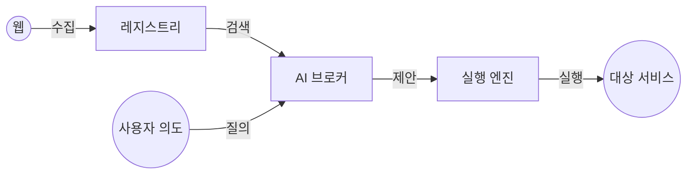

# IntentLink 시스템 아키텍처
> "IntentLink 생태계가 어떻게 작동하는지에 대한 전체 조감도"

## 🏗️ 시스템 개요

IntentLink는 혼란스러운 웹 정보를 구조화된 실행 가능한 네트워크로 변환하는 4단계 파이프라인으로 구성됩니다.



## 🧩 핵심 컴포넌트

### 1. 발견 계층 (Discovery Layer)
- **Harvester (`registry/awesome-harvester.js`):** 웹상의 Awesome List 등을 크롤링하여 서비스 후보를 수집합니다.
- **Extractor Skill (`skills/link-extractor`):** 수집된 문서에서 `link.json` 명세서를 추출하는 AI 스킬입니다.
- **Validator (`validator/link-validator.js`):** 명세서의 품질을 검증하고 신뢰도 점수(Confidence Score)를 부여합니다.

### 2. 지식 계층 (Knowledge Layer)
- **Registry (`registry/`):** 서비스들의 로컬 데이터베이스입니다.
- **Index (`registry/index/*.json`):** 각 서비스의 명세서가 JSON 파일로 저장됩니다.

### 3. 지능 계층 (Intelligence Layer)
- **Broker (`broker/optimized-broker.js`):** 시스템의 두뇌입니다. 벡터 검색과 다단계 랭킹 알고리즘을 통해 사용자 의도와 서비스 능력을 매칭합니다.

### 4. 실행 계층 (Execution Layer)
- **Runner (`runner/link-runner.js`):** 제안된 연결을 사용자의 승인 하에 안전하게 실행합니다.
- **Connector (`connector/link-connector.js`):** 개발자가 사용할 수 있는 실제 연동 코드(Node.js)를 생성합니다.

## 🔄 데이터 흐름 (Pipeline)

1.  **Raw Data:** `https://api.example.com` (문서/HTML)
    *   ⬇️ *AI 스킬이 추출*
2.  **Manifest:** `link.json` (의도, 제공 기능, 필요 기능)
    *   ⬇️ *레지스트리에 인덱싱*
3.  **Search Result:** 브로커가 사용자 질의에 맞는 후보 검색
    *   ⬇️ *브로커가 정밀 분석*
4.  **Proposal:** `Connection Proposal` (리스크 분석 및 실행 로직 포함)
    *   ⬇️ *러너가 처리*
5.  **Action:** API 호출 또는 코드 생성

## 📂 폴더 구조 맵

```text
intentlink/
├── bin/                 # CLI 실행 파일 (intentlink 명령어)
├── broker/              # 매칭 및 랭킹 로직
├── connector/           # 코드 생성 엔진
├── registry/            # 탐색 및 저장 시스템
├── runner/              # 실행 및 모킹 엔진
├── services/            # 서비스 명세서 예시
├── skills/              # AI 에이전트 스킬 (Link Extractor)
└── validator/           # 품질 검증 도구
```
