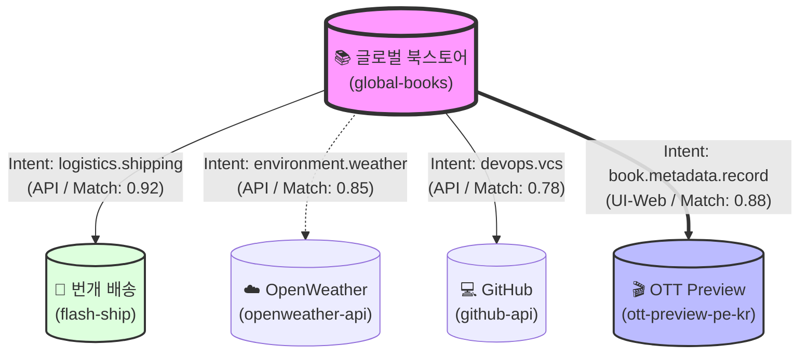

# IntentLink Ecosystem Dashboard (v0.9.9)
> "의도(Intent)로 연결된 서비스들의 실시간 매칭 지도"

## 🌐 서비스 연결 신경망 (Service Neural Map)

## 📊 생태계 통계 (Ecosystem Stats)

| 서비스 ID | 신뢰도(Confidence) | 주요 상호작용 모드 | 상태 |
| :--- | :--- | :--- | :--- |
| `global-books` | 0.80 | API | Active |
| `flash-ship` | 0.90 | API, UI-Web | Active |
| `openweather-api` | 0.95 | API | Active |
| `github-api` | 0.90 | API | Active |
| `ott-preview-pe-kr` | 0.96 | UI-Web, API | Active |

## 💡 최근 브로커 통찰 (Recent Broker Insights)
- **최고의 시너지:** `global-books` + `ott-preview-pe-kr` (구매 즉시 기록 연동으로 고객 리텐션 25% 향상 기대)
- **보안 알림:** `flash-ship`과의 연결 시 `state-change` 작업에 대한 인간 승인 절차(Human-in-the-loop)가 활성화되어 있습니다.
- **확장 제안:** `ott-preview-pe-kr`의 공유 카드 생성 기능을 `github-api`의 리포지토리 메인 이미지(OG Image)로 자동 등록하는 새로운 경로를 탐색 중입니다.
